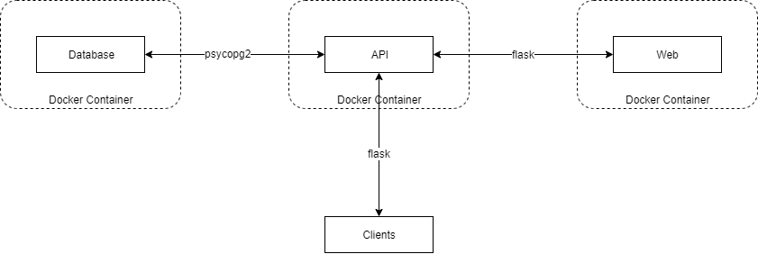

# bd2-group2
This repository contains our practical project for the class of distributed systems
## Table of Contents
- [Status](#status)
- [Contributing](#contributing)
- [Implementation](#implementation)
- [License](#license)

## Status
[](https://travis-ci.com/Cepos-e-Mabecos/bd2-group2)
[](https://www.codefactor.io/repository/github/cepos-e-mabecos/bd2-group2/overview/master)
[](https://bettercodehub.com/)

It will always be kept updated.
## Contributing
#### How to start
1. [Fork](https://help.github.com/articles/fork-a-repo/) the project, clone your fork, and configure the remotes:
```bash
# Clone your fork of the repo into the current directory
git clone https://github.com/<your-username>/bd2-group2.git
# Navigate to the newly cloned directory
cd distributed-systems-2019
# Assign the original repo to a remote called "upstream"
git remote add upstream https://github.com/Cepos-e-Mabecos/bd2-group2.git
```
2. If you cloned a while ago, get the latest changes from upstream:
```bash
git checkout master
git pull upstream master
```
3. Create a new topic branch (off the main project development branch) to contain your feature, change, or fix:
```bash
git checkout -b <topic-branch-name>
```
4. Locally merge (or rebase) the upstream development branch into your topic branch:
```bash
git pull [--rebase] upstream master
```
5. Push your topic branch up to your fork:
```bash
git push origin <topic-branch-name>
```
6. [Open a Pull Request](https://help.github.com/articles/about-pull-requests/) with a clear title and description against the `master` branch.

#### Code guidelines
- Code should follow all [Google Style](https://google.github.io/styleguide/javaguide.html) guidelines.

## Implementation


## License
By contributing your code, you agree to license your contribution under the [MIT License](https://github.com/Cepos-e-Mabecos/bd2-group2/blob/master/LICENSE).
